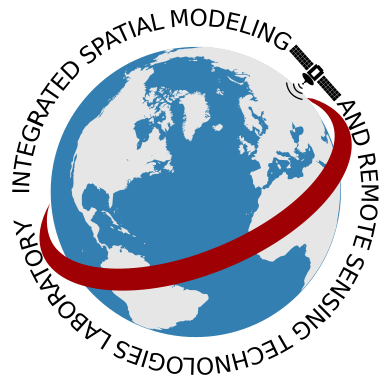

  

<h1 align="center">🌎 I-SMART Lab</h1>

<i>Integrated Spatial Modeling and Remote Sensing Laboratory</i>

<b>Department of Civil, Environmental, and Ocean Engineering (CEOE) 
Stevens Institute of Technology</b>

  
  
  

---

## 🔬 About Us
The **I-SMART Lab** focuses on applying satellite remote sensing, geospatial modeling, and advanced data analytics to address critical issues in hydrology, climate, and environmental monitoring.  
We aim to develop innovative solutions for **water resources management, climate change adaptation, and disaster resilience**.  

Our mission is to:
- Enhance scientific understanding of environmental processes through remote sensing.  
- Develop models for monitoring **land, ocean, and atmospheric systems**.  
- Provide actionable knowledge to policymakers, industries, and communities.  

---

## 🚀 Research Thrusts
- 🌍 **Land** — Hydrology, soil moisture, land use, water resources  
- 🌊 **Ocean** — Flooding, coastal modeling, water quality  
- ☁️ **Atmosphere** — Weather, fog, climate, air quality  
- 🤖 **AI/ML** — Remote sensing with machine learning & deep learning  

---

## 🏗️ Projects

 US Grants (Selected)

- **PI**: *Assessing the integration of river ice information in the National Water Model to enhance river flow routing in northern watersheds* — NOAA COMET Program (2021–2022).  
- **Co-I**: *Operational river ice monitoring and forecasting over the US and the globe using SNPP and NOAA-20 VIIRS imagery* — NOAA JPSS (2018–2021).  
- **Co-I**: *An enhanced operational system for the mapping of river ice using SNPP VIIRS for river ice-jam modeling* — NOAA JPSS (2016–2018).  
- **PI**: *Surface water extent and inundation mapping using observations from NPP ATMS sensor* — NOAA JPSS (2012–2013).  
- **Co-I**: *River and Lake Ice mapping using NPP/JPSS VIIRS sensor to support NOAA NWS* — NOAA JPSS (2012–2015).  
- **Co-I**: *Application of evapotranspiration and soil moisture remote sensing products to enhance hydrological modeling for decision support in the New York City water supply* — NASA Earth Science Division (2011).  
- **PI**: *Assessment of assimilating NPP/JPSS ATMS land surface sensitive observations in the NOAA Global Forecast System using GSI* — NOAA JCSDA JPSS Program (2012–2013).  
- **PI**: *Establishment of a soil moisture observation network to support SMAP Cal/Val activities* — NASA Science Mission Directorate (2012–2017).  
- **Collaborator**: *HASILHEP: Hawaii-Siliana Higher Education Partnership for Strengthening the Capacity of Siliana's Higher Institute of Technological Studies* — USAID.  
- **PI**: *River ice monitoring over the Susquehanna River Basin using remote sensing data* — NOAA NWS (2009–2012).  
- **PI**: *NOAA-CREST Land Emissivity Products From Passive Microwave Observations* — NOAA NWS (2012).  
- **Co-I**: *Enhanced use of GOES for estimating land surface wetness with application to wildfire forecasting* — NOAA GIMPAP (2012).  
- **Co-I**: *Establishing the application of high resolution satellite imagery to improve coastal and estuarine models* — NASA ROSES A.28 (2008).  
- **Co-I**: *Evaluation of Residential and Transportation Impact of Predicted Coastal Flooding in Climate Change* — UTRC (2012).  
- **PI**: *Development of an advanced technique for mapping and monitoring sea and lake ice for the future GOES-R ABI* — NOAA NESDIS (2009–2011).  
- **Co-I**: *Understanding and improving California’s river and water resources predictions using in situ and remote sensing data* — NOAA NWS (2009).  

🌍 International Grants (Selected, total ≈ $10M)

- **PI**: *A novel system for air quality monitoring using satellite- and modeling-based techniques: Towards real-time high-resolution monitoring of air quality* — UAE Ministry of Climate Change and Environment (2016–2020).  
- **PI**: *Towards achieving a fog-ready air traffic management system for Etihad Airways: Numerical forecast and satellite tracking of fog* — Etihad Airways (2015–2020).  
- **PI**: *Numerical Modelling of Radionuclides Dispersion in the UAE Environment (MORAD Project)* — UAE Federal Authority for Nuclear Regulation (2019–2022).  
- **PI**: *Study on Particulate Matter PM2.5 Composition and its Correlation with PM10 Concentrations* — UAE Ministry of Environment and Water (2015–2016).  
- **PI**: *Combat the emerging impacts of harmful algal blooms on desalination plants using satellite imagery and hydrodynamic modeling* — USAID & MEDRC (2015–2016).  
- **PI**: *Integrating schemes from UAE Rain Enhancement Projects into a unified multi-component atmospheric model* — UAE National Center of Meteorology (2018–2022).  
- **PI**: *Integrating satellite passive microwave and optical data to enhance the monitoring of Antarctic sea ice* — Australian Antarctic Division & Masdar UAE (2018–2020).  
- **Co-I**: *Calibration and Validation of NASA SMAP satellite for the retrieval of Soil Moisture and its application to water resources and dust storms in Kuwait* — Kuwait Foundation for the Advancement of Science (2012–2017).  

---

## 📚 Featured Publications
- Francis, D. *et al.* (2021). **Summertime dust storms over the Arabian Peninsula and impacts on radiation, circulation, cloud development and rain.** *Atmospheric Research, 250.*  
- Weston, M. *et al.* (2021). **On the Analysis of the Low-Level Double Temperature Inversion in the Environment of Fog Formation Over Abu Dhabi International Airport.** *IEEE Geoscience and Remote Sensing Letters, 18(2).*  

👉 [See full publication list →](ismart_publications.md)

---

## 🌐 Products

Discover the data products and services developed at **I-SMART Lab**, focused on Earth system monitoring and applications:

- **🌍 Land** — [Explore Land Products](https://web.stevens.edu/ismart/land.html)  
- **🌊 Ocean** — [Explore Ocean Products](https://web.stevens.edu/ismart/ocean.html)  
- **☁️ Atmosphere** — [Explore Atmosphere Products](https://web.stevens.edu/ismart/atmosphere.html)  

---

## 📬 Contact

**I-SMART Lab**  
Department of Civil, Environmental, and Ocean Engineering (CEOE)  
**Stevens Institute of Technology**  
1 Castle Point Terrace, Hoboken, NJ 07030, USA  

- 📧 **Email**: [mtemimi@stevens.edu](mailto:mtemimi@stevens.edu)  
- 📞 **Phone**: +1 (201) 216-5303  
- 🌐 **Website**: [I-SMART Lab Website](https://web.stevens.edu/ismart/index.html)  

---

  © 2025 I-SMART Lab · <a href="https://www.stevens.edu/">Stevens Institute of Technology</a>

